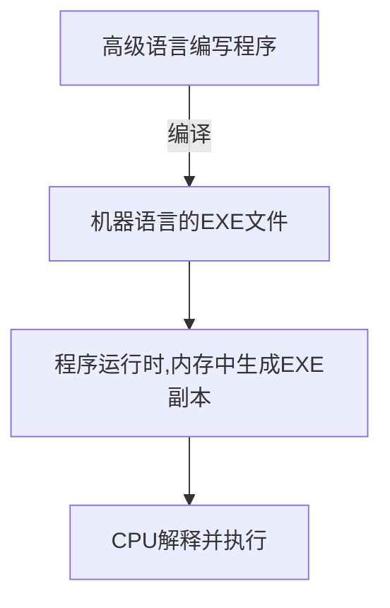

## 程序是怎么跑起来的

### 简介
- 作者： 矢泽久雄

### CPU
1. 程序运行流程

2. CPU构成

* **寄存器** 用来暂存指令、数据
* **控制器** 把内存上的指令、数据读入寄存器，并根据指令的执行结果来控制整个计算器
* **运算器** 运算从内存读入寄存器的数据
* **时钟** 发出CPU开始计时的时钟信号

3. 机器语言 -> 汇编语言 -> 高级语言
函数的调用机制： 栈
- call指令
- return指令

4. 程序在内存里的构成
- 指令区域
- 数据区域
- 栈区域

### 数据
1. 进制
- 基数
- 位权

2. 移位运算

3. 补码 = 反码 + 1

### 浮点数
1. 构造
+-     m  *  n   **   e
符号  尾数    基数     指数
指数部分采用Excess系统，表示负数时不使用符号位
尾数部分采用将小数点前部分固定位1的方式
double： 1位符号位 + 11位基数位 + 52位尾数位
float：  1位符号位 + 8位基数位 + 23位尾数位 

### 内存

