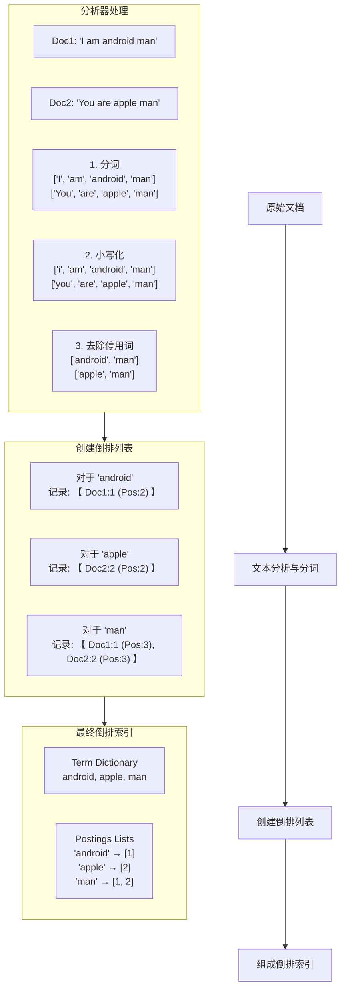

### 引言：为什么 Elasticsearch 是后端开发的利器
在我们的日常开发里，Elasticsearch(之后都简称 ES) ~~可能~~ 是我们用的最多的搜索引擎。根据 Elastic 公司官方文档的描述，其定义是：
>> Elasticsearch 是一个分布式的、开源的搜索和分析引擎，适用于所有类型的数据，包括文本、数字、地理空间、结构化和非结构化数据。

ES 在后端技术栈中的定位是非主数据库，而是专业的搜索与分析引擎。

就以我们内部的典型应用场景就包括：
- 站内搜索，例如我们的UGC平台
- 日志处理（ELK/EFK）[Kibana DEV](https://shuyuan.fuxi.netease.com/logsearch/es/kibana_dev#/)
- 数据存储：之前 UX D90 战绩有一个单节点数据库写入性能的问题，也是通过写入到 ES 优化解决

总所周知，如果只是要实现搜索，我们可以不必引入新的实体，MySQL 本身可以通过 LIKE 或者 FULLTEXT 索引来实现，但最终大家还是选择了 ES。
简单比较一下, 我们就知道他的强大之处。

| 特性 | LIKE 操作符 | 数据库全文索引 (FULLTEXT) | Elasticsearch 倒排索引 |
| --- | --- | --- | --- |
| 核心原理 | 逐行扫描 | “小型”倒排索引 | 高度优化、分布式的倒排索引 |
| 实现机制 | 对每一行逐字符匹配，相当于 grep 整个表 | 为文本列创建专用倒排索引结构 | 专为搜索而设计，核心为分布式倒排索引 |
| 索引结构 | 无索引；B-Tree 对前导通配符 %abc 失效 | 倒排索引：词条 → 文档映射 | FST 压缩词典，FOR 等压缩的倒排列表 |
| 分词处理 | 无分词，按完整字符串匹配 | 有分词但较简单、语言支持有限 | 可插拔分词器，支持中文 IK、同义词、词干还原等 |
| 查询能力 | 模糊匹配（%/_），无相关度，跨字段弱 | 基础布尔/短语，相关度与跨字段受限 | DSL 丰富：bool、multi_match、phrase/邻近、function_score、script、highlight |
| 性能 | 易退化为全表扫描，I/O 放大，QPS 低，难横向扩展 | 单机索引，写入/更新较重，复杂查询易退化 | 分片并行+副本读扩展，缓存+doc_values 聚合，吞吐高、延迟低 |

### 核心基础：理解数据如何被存储和检索

1. 倒排索引 (Inverted Index) - ES 的基石

### 倒排索引构建示例 (以标准分析器为例)

**文档内容：**
*   **Doc 1:** `"I am android man"`
*   **Doc 2:** `"You are apple man"`

---

#### 第一步：文本分析与分词 (Analysis)

分析器（这里假设是标准分析器 `standard`）会对文本进行以下处理：
1.  **分词**：按单词边界切分。
2.  **小写化**：将所有字母转换为小写。
3.  **去除停用词**：过滤掉没有实际意义的词（如 `I`, `am`, `you`, `are`）。

**处理结果：**

| 原始文档 | 处理后的词条 (Tokens) |
| :--- | :--- |
| Doc 1: `"I am android man"` | `["android", "man"]` |
| Doc 2: `"You are apple man"` | `["apple", "man"]` |

---

#### 第二步：构建倒排索引

系统会为处理后的词条创建映射，记录每个词出现在哪个文档、出现次数及其位置。

**生成的倒排索引结构如下：**

| Term (词项) | Postings List (倒排列表) |
| :--- | :--- |
| `android` | `[1]` <br> **(文档ID: 1, 词频: 1, 位置: 2)** |
| `apple` | `[2]` <br> **(文档ID: 2, 词频: 1, 位置: 2)** |
| `man` | `[1 (freq=1, pos=3), 2 (freq=1, pos=3)]` <br> **(文档ID: 1, 词频: 1, 位置: 3)<br>(文档ID: 2, 词频: 1, 位置: 3)** |

这个过程可以通过下面的流程图更直观地展现：



---

#### 第三步：如何执行查询？

**示例查询：搜索 `man`**

1.  **查询处理**：查询词 `man` 也会经过相同的分析过程（小写化），变成 `man`。
2.  **查找词项**：在 **Term Dictionary** 中快速查找词项 `man`。
3.  **获取倒排列表**：找到 `man` 对应的 **Postings List**：`[1, 2]`。
4.  **返回结果**：引擎立即知道文档 1 和文档 2 匹配，并可以根据词频等信息进行评分，最终返回这两个文档。

**示例查询：搜索 `android man`**

1.  **查询处理**：分析后得到词条 `["android", "man"]`。
2.  **查找词项**：分别查找 `android` (列表 `[1]`) 和 `man` (列表 `[1, 2]`)。
3.  **集合操作**：执行**交集**操作，找到共同包含这两个词的文档，得到结果 `[1]` (文档1)。
4.  **返回结果**：返回文档 1。

通过这个例子，你可以看到，即使用户输入了完整的句子 `"I am android man"`，搜索引擎实际上是通过查找 `android` 和 `man` 这两个关键词来快速定位到文档的，这就是倒排索引强大和高效的原因。


2. 映射 (Mapping) - 数据的蓝图

好的，我们深入扩展一下 Elasticsearch 的 Mapping，这对于后端工程师设计和优化索引至关重要。

### **映射 (Mapping) - 数据的蓝图**

Mapping 是 Elasticsearch 中用于定义文档及其字段如何存储和索引的过程。它相当于关系型数据库中的表结构（Schema）。

---

### **一、核心字段类型 (Core Field Types)**

理解字段类型是设计 Mapping 的基石。错误的类型会导致无法进行预期的查询和聚合。

#### **1. `text` vs `keyword` - 最核心的区别**

这是最重要也是最容易混淆的一对类型。

| 特性 | `text` | `keyword` |
| :--- | :--- | :--- |
| **用途** | **用于全文搜索 (Full-Text Search)** | **用于精确值匹配 (Exact-Value)** |
| **分词** | **是**。会被指定的分析器（如 `standard`, `ik_smart`) 分解成独立的词项（Tokens），并建立倒排索引。 | **否**。将整个字符串作为一个**完整的、不可分割的词项**进行索引。 |
| **查询** | 使用 `match` 查询进行全文搜索。 | 使用 `term` 查询进行精确匹配。 |
| **聚合/排序** | **通常不行**。因为分词后，系统不知道用哪个词项来排序或分组。 | **可以**。是进行排序（Sorting）、桶聚合（Terms Aggregation）、脚本计算的理想选择。 |
| **示例** | 产品描述、文章内容、日志消息体。 | 用户ID、状态码（如 `"published"`）、邮箱、标签（Tags）、邮编、枚举值。 |

**为什么需要区分？**
想象一个字段 `"product_name": "iPhone 13 Pro"`。
*   如果你希望搜索 `"iphone"` 也能找到它，应该用 `text` 类型。
*   如果你希望精确匹配 `"iPhone 13 Pro"` 这个完整字符串（例如作为聚合键或过滤器），或者要按产品名排序，就必须用 `keyword` 类型。

**解决方案：多字段 (Multi-Fields)**
通常，一个字段需要同时满足全文搜索和精确匹配两种需求。Elasticsearch 提供了强大的 **`fields`** 参数来实现这一点。

```json
{
  "mappings": {
    "properties": {
      "product_name": {
        "type": "text",         // 主字段，用于全文搜索
        "analyzer": "ik_smart", // 使用中文分词器
        "fields": {
          "keyword": {          // 子字段，名为 `product_name.keyword`
            "type":  "keyword"  // 用于精确匹配、排序和聚合
          },
          "pinyin": {           // 甚至可以定义第三个子字段用于拼音搜索
            "type": "text",
            "analyzer": "pinyin"
          }
        }
      }
    }
  }
}
```
*   **查询全文**：`{"match": {"product_name": "手机"}}`
*   **精确匹配/排序/聚合**：`{"term": {"product_name.keyword": "华为Mate50手机"}}` 或 `"sort": [{"product_name.keyword": "asc"}]`

#### **2. 其他重要类型**

*   **数字类型**: `long`, `integer`, `short`, `byte`, `double`, `float`, `half_float`, `scaled_float`
    *   **选择建议**：在满足需求的前提下，优先选择范围较小的类型（如用 `integer` 而不是 `long`），有助于节省磁盘空间和提高效率。
*   **日期类型 (date)**:
    *   可以存储年月日时分秒的时间数据。
    *   **格式多样**：允许指定解析格式，如 `"yyyy-MM-dd HH:mm:ss"`、`"epoch_millis"`（时间戳）。
    *   **重要特性**：在 Elasticsearch 内部被处理为 UTC 时间戳，支持非常强大的日期直方图聚合。
*   **布尔类型 (boolean)**: `true` 或 `false`。
*   **对象类型 (object)**:
    *   用于处理单个 JSON 对象（有嵌套结构）。例如：
        ```json
        "user": {
          "first": "John",
          "last": "Smith"
        }
        ```
    *   **存储方式**：Elasticsearch 会将其扁平化处理，内部存储为 `user.first: ["john"]`, `user.last: ["smith"]`。
*   **嵌套类型 (nested)**:
    *   **解决 `object` 类型的问题**：`object` 类型的数组中的对象是**相互独立**的，在查询时会出现**交叉匹配**的错误。
    *   **工作原理**：`nested` 类型将数组中的每个对象都作为一个**独立的隐藏文档**来索引，从而保持了对象内部字段间的关联性。查询时必须使用 `nested` 查询。

**`object` vs `nested` 示例：**
假设有一个 `products` 的 `object` 类型数组：
```json
[
  { "name": "phone", "color": "black" },
  { "name": "car", "color": "red" }
]
```
一个查询 `"name: phone AND color: red"` 会错误地匹配到这个文档，因为 `name` 和 `color` 被扁平化到了一个数组中 `["phone", "car"]` 和 `["black", "red"]`。使用 `nested` 类型可以避免这个问题。

---

### **二、`dynamic` 参数的重要性**

这个参数控制着如何处理 Mapping 中未明确定义的字段（新字段）。它对生产环境的稳定性至关重要。

| 模式 | 行为 | 优点 | 缺点 | 适用场景 |
| :--- | :--- | :--- | :--- | :--- |
| **`true` (动态映射)** | 自动检测新字段的类型并将其添加到 Mapping 中。 | 方便快捷，上手简单。 | **极其危险**。可能因错误推断类型导致 mapping 混乱（如将数字推断为 `text`），且 mapping 的字段一旦建立，后期修改非常麻烦。 | 仅用于快速原型验证和开发测试环境。 |
| **`false` (静态映射)** | **忽略**新字段。该字段不会被索引，也不会出现在 Mapping 中。 | 避免 mapping 膨胀，防止“映射爆炸”。数据中可能有无关的垃圾字段也不会影响系统。 | 如果业务确实需要查询新字段，但由于被忽略而无法查询，需要手动添加。 | **生产环境的推荐设置**。你明确控制 Mapping 的结构，对未知字段持保守态度。 |
| **`strict` (严格模式)** | **拒绝**包含新字段的文档。写入会直接失败并抛出异常。 | 强制要求数据的结构和格式必须完全符合预期，保证数据质量。 | 开发灵活性差，任何未知字段都会导致写入中断。 | 对数据格式要求极其严格的场景，如金融、审计等。 |

**生产环境最佳实践：**
1.  **将 `dynamic` 设置为 `false`**。
2.  在上线前，**预先定义好已知的所有字段**的 Mapping。
3.  如果需要添加新字段，**通过 Mapping API 显式地更新 Mapping**。这是一个需要评审和部署的变更操作，而不是自动进行。


3. 分词与分析器 (Analysis & Analyzer) - 文本处理的核心

好的，我们来深入扩展 Elasticsearch 的分词与分析器 (Analysis & Analyzer)，这是决定搜索质量和效果最核心的环节。

### **分词与分析器 (Analysis & Analyzer) - 文本处理的核心**

Analysis（分析）是将文本（如一个句子）转换为**词条（tokens** 或 **terms**）的过程。这个过程由**分析器（Analyzer）** 执行。分析器的好坏直接决定了搜索引擎的召回率（能搜到吗？）和准确率（搜到的是想要的吗？）。

---

### **一、分析器的结构：三部分流水线工作**

分析器不是一个单一组件，而是一个包含三个步骤的**包装器**，文本会依次经过它们进行处理。

```mermaid
flowchart LR
A["原始文本<br>The quick brown-fox's!"] --> B[Character Filters]
B -- "字符流<br>The quick brown-fox's!" --> C[Tokenizer]
C -- "词条流[The, quick, brown-fox's!]" --> D[Token Filters]
D -- "最终词条[quick, brown, fox]" --> E["倒排索引"]

subgraph Analyzer[分析器 (Analyzer)]
    direction LR
    B[字符过滤器<br>Character Filters]
    C[分词器<br>Tokenizer]
    D[词条过滤器<br>Token Filters]
end
```

#### **1. 字符过滤器 (Character Filters)**

*   **职责**：在文本被分词**之前**，对**原始文本流**进行预处理。
*   **操作对象**：原始的字符串，比如去掉 HTML 标签、将 `&` 转换为 `and`、或者去除特定的字符。
*   **类型**：
    *   **HTML Strip Character Filter**：去除 HTML 标签（如 `<b>`, `</p>`）和转义字符（如 `&amp;`）。
    *   **Mapping Character Filter**：根据配置的映射关系进行字符替换（如将 `Ⅳ` 映射为 `IV`，或将 `:)` 替换为 `_happy_`）。
    *   **Pattern Replace Character Filter**：使用正则表达式匹配并替换字符。

#### **2. 分词器 (Tokenizer)**

*   **职责**：接收**字符过滤器处理后的文本流**，将其**切分成一个个独立的词条（Token）**。这是分析过程中**最关键的一步**，一个分析器**有且只有一个**分词器。
*   **操作对象**：字符串。
*   **类型**：
    *   **Standard Tokenizer**：基于 Unicode 文本分割算法，按单词边界进行分词。这是最常用的分词器。
    *   **Whitespace Tokenizer**：简单地根据空格来分割文本。
    *   **Keyword Tokenizer**：一个“什么都不做”的分词器，它把整个输入作为一个单一的词条输出。适用于 `keyword` 字段。
    *   **Pattern Tokenizer**：使用正则表达式来分割文本。
    *   **ICU Tokenizer**：提供对多语言更好的支持，需要安装 `analysis-icu` 插件。
    *   **IK Tokenizer**：**中文分词器**，需要安装 `ik` 插件。提供 `ik_smart`（粗粒度）和 `ik_max_word`（细粒度）两种模式。

#### **3. 词条过滤器 (Token Filters)**

*   **职责**：接收**分词器产生的词条流**，对其进行**添加、删除或修改**操作。
*   **操作对象**：词条（Token）。
*   **类型**（非常丰富）：
    *   **Lowercase Filter**：将所有词条转换为小写。**至关重要**，确保搜索不区分大小写。
    *   **Stop Token Filter**：移除停用词（stop words），如 `a`, `an`, `the`, `的`, `是`, `在` 等。可以减少索引大小，提升效率，但有时会影响短语搜索。
    *   **Synonym Graph Filter**：**同义词过滤器**。允许你将词条扩展为其同义词（如 `jump` -> `leap`），或者将词条替换为同义词（如 `iPhone` -> `苹果手机`）。极大地提升召回率。
    *   **Stemmer Filter**：**词干还原器**。将单词还原为其词根形式，如 `jumping`, `jumped` -> `jump`；`cars` -> `car`。英语等语言中非常有用。
    *   **Length Filter**：过滤掉太长或太短的词条（如移除长度小于 2 的词）。
    *   **Trim Filter**：去除词条两端的空白字符。

---

### **二、内置与分析器插件**

Elasticsearch 将上述组件组合在一起，形成了一些开箱即用的分析器。

#### **1. 内置分析器 (Built-in Analyzers)**

*   **Standard Analyzer**：
    *   **组成**：Standard Tokenizer + Lowercase Token Filter。
    *   **效果**：`"The 2 QUICK Brown-Foxes."` -> `[the, 2, quick, brown, foxes]`
    *   **场景**：大多数西方语言的默认选择。

*   **Simple Analyzer**：
    *   **组成**：Simple Tokenizer（遇到非字母的字符就切分） + Lowercase Token Filter。
    *   **效果**：`"The 2 QUICK Brown-Foxes."` -> `[the, quick, brown, foxes]`

*   **Whitespace Analyzer**：
    *   **组成**：Whitespace Tokenizer。
    *   **效果**：`"The 2 QUICK Brown-Foxes."` -> `[The, 2, QUICK, Brown-Foxes.]`
    *   **注意**：**不会小写化**。

*   **Stop Analyzer**：
    *   **组成**：Simple Tokenizer + Lowercase Token Filter + Stop Token Filter。
    *   **效果**：`"The 2 QUICK Brown-Foxes."` -> `[quick, brown, foxes]`（移除了 `the` 和 `2`）

*   **Keyword Analyzer**：
    *   **组成**：Keyword Tokenizer。
    *   **效果**：`"The 2 QUICK Brown-Foxes."` -> `[The 2 QUICK Brown-Foxes.]`（整个句子作为一个词条）
    *   **场景**：相当于 `"type": "keyword"`。

#### 2. 中文分析器插件（需安装）

*   **IK Analyzer (ik_smart)**：
    *   **模式**：**粗粒度**切分。
    *   **效果**：`"中华人民共和国国歌"` -> `[中华人民共和国, 国歌]`
    *   **场景**：保证颗粒度较粗，召回率相对较低，但准确率高。

*   **IK Analyzer (ik_max_word)**：
    *   **模式**：**细粒度**切分（最细粒度拆分）。
    *   **效果**：`"中华人民共和国国歌"` -> `[中华人民共和国, 中华人民, 中华, 华人, 人民共和国, 人民, 共和国, 共和, 国, 国歌]`
    *   **场景**：尽可能多的分出词条，召回率高，但可能搜出一些不相关的结果。

---

### **三、如何测试与使用分析器？**

#### **1. 使用 `_analyze` API 进行测试**

这是调试和分析文本如何被处理的最重要工具。

```json
GET /_analyze
{
  "analyzer": "ik_max_word", // 指定一个现成的分析器
  "text": "你好，世界！Hello World!"
}

// 或者，手动组合组件来模拟自定义分析器
GET /_analyze
{
  "tokenizer": "ik_smart",
  "filter":  [ "lowercase" ], // 注意这里是 filter
  "text": "你好，世界！Hello World!"
}
```

#### **2. 在 Mapping 中指定分析器**

你可以在定义字段时为其指定分析器。

```json
PUT /my_index
{
  "mappings": {
    "properties": {
      "content_cn": {
        "type": "text",
        "analyzer": "ik_max_word",  // 索引时使用的分析器
        "search_analyzer": "ik_smart" // 查询时使用的分析器（可选，默认为analyzer设置）
      },
      "content_en": {
        "type": "text",
        "analyzer": "standard"
      }
    }
  }
}
```

*   **`analyzer`**：定义在**索引（写入）** 时使用的分析器。
*   **`search_analyzer`**：定义在**搜索（查询）** 时使用的分析器。通常两者保持一致，但有时也会不同（例如索引时用细粒度，搜索时用粗粒度来提高精度）。


### 搜索 DSL（Domain Specific Language）

Elasticsearch 提供了一套基于 JSON 的完整查询 DSL（Domain Specific Language）来定义查询


### **搜索 DSL：`term`, `terms`, `match` 与 `bool` 查询**

#### **一、核心概念：Query Context vs. Filter Context**

在深入之前，必须理解这两个核心概念，它们决定了 Elasticsearch 的行为和性能。

| 特性 | **查询上下文 (Query Context)** | **过滤上下文 (Filter Context)** |
| :--- | :--- | :--- |
| **核心问题** | 这个文档**匹配得有多好？** | 这个文档**是否匹配？** |
| **答案** | 相关性分数 `_score` (一个浮点数) | 是 (`true`) 或 否 (`false`) |
| **性能** | 相对较慢，因为需要计算分数。 | **非常快**。结果可以被缓存到内存中。 |
| **典型用法** | 全文搜索，根据相关性排序。 | 精确值匹配、范围过滤、用于筛选数据。 |
| **影响评分** | **是** | **否** |

---

### 二、`term` 与 `terms` 查询：精确值匹配

这类查询几乎总是用于 **Filter Context**。

#### **1. `term` 查询**

*   **用途**：查找在**指定字段中包含 exactly（精确）** 给定**词项（Term）** 的文档。
*   **重要特性**：**不会对查询文本进行分词**。你查询什么，它就去倒排索引里精确匹配什么。
*   **适用字段类型**：`keyword`、`number`、`date`、`boolean` 等。**对 `text` 字段使用 `term` 查询是新手最常见的错误。**

**示例：查找精确的标签或状态**
```json
GET /products/_search
{
  "query": {
    "term": {
      "status": { // status 字段的类型应为 `keyword`
        "value": "published" // 精确查找 status = "published" 的文档
      }
    }
  }
}
```

#### **2. `terms` 查询**

*   **用途**：`term` 查询的升级版，允许你指定多个值。相当于 SQL 中的 `IN` 操作。
*   **逻辑**：如果文档的指定字段包含**任何一个**列出的词项，则匹配。

**示例：查找多个标签的商品**
```json
GET /products/_search
{
  "query": {
    "terms": {
      "tags": [ "apple", "iphone", "smartphone" ] //  tags 字段应是 `keyword` 类型或使用 `.keyword` 子字段
    }
  }
}
```

---

### **三、`match` 查询：全文搜索**

这类查询用于 **Query Context**，是进行全文搜索的首选工具。

*   **用途**：在指定的 `text` 字段中执行**全文检索**。
*   **重要特性**：**会对查询文本进行分词**！查询文本会经过与分析器相同的处理过程（小写化、分词等），生成一系列词项，然后再去执行查询。
*   **默认操作**：多个分词后的词项之间是 `OR` 关系。

**示例：搜索包含“苹果手机”的商品**
```json
GET /products/_search
{
  "query": {
    "match": {
      "description": "苹果手机" // 1. 分词器会将“苹果手机”分词为 ["苹果", "手机"]
                                // 2. 然后去 description 字段的倒排索引中查找包含“苹果”OR“手机”的文档
                                // 3. 计算相关性得分 _score 并排序
    }
  }
}
```

**`match` 查询的变种：**
*   **`match_phrase`**：用于**短语搜索**，要求分词后的词项必须**按顺序**、**紧挨着**出现。`slop` 参数允许词项之间有间隔。
*   **`match_bool_prefix`**：只对最后一个词项做前缀匹配，前面的词项做精确匹配。
*   **`multi_match`**：允许在多个字段上执行同一个 `match` 查询。

---

### **四、`bool` 查询：组合查询的瑞士军刀**

这是 Elasticsearch 中**最强大、最常用的查询**，它允许你将多个查询子句以逻辑方式组合起来。它接收四个可选参数，每个参数都是一个查询数组。

#### **1. `must` (必须满足 - 逻辑 AND)**

*   **上下文**：Query Context
*   **含义**：子句**必须**出现在匹配的文档中。所有 `must` 子句的条件都**必须满足**。
*   **贡献评分**：**是**。匹配的子句将参与贡献相关性分数 `_score`。

#### **2. `filter` (必须满足 - 逻辑 AND，但不评分)**

*   **上下文**：Filter Context
*   **含义**：子句**必须**出现在匹配的文档中。所有 `filter` 子句的条件都**必须满足**。
*   **贡献评分**：**否**。分数被忽略，子句被自动缓存，**性能极佳**。用于结构化数据过滤（如时间范围、状态、标签）。

#### **3. `should` (应该满足 - 逻辑 OR)**

*   **上下文**：Query Context
*   **含义**：子句**应该**出现在匹配的文档中。其行为取决于它是否在 `must` 或 `filter` 子句的上下文中：
    *   **如果 `bool` 查询中没有 `must` 或 `filter`**：文档只需满足 `should` 数组中的**一个或多个**条件即可匹配。可以使用 `minimum_should_match` 参数控制最少需满足的条件数。
    *   **如果 `bool` 查询中包含了 `must` 或 `filter`**：此时 `should` 子句变得可选，用于**增加文档的相关性分数**。满足的 `should` 条件越多，文档的 `_score` 就越高。它不再影响文档是否匹配，只影响匹配后的排名。

#### **4. `must_not` (必须不满足 - 逻辑 NOT)**

*   **上下文**：Filter Context
*   **含义**：子句**绝对不能**出现在匹配的文档中。
*   **贡献评分**：**否**。分数被忽略，子句被自动缓存。

---

### 五、综合示例

假设我们要构建一个复杂的商品搜索：
*   **必须 (must)**：商品标题包含“手机”。
*   **必须 (filter)**：状态是“已发布”(`published`)，并且上架时间在2023年内。
*   **应该 (should)**：(加分项) 品牌是“苹果”或者“华为”，这样可以提高排名。
*   **必须不 (must_not)**：不能是“预售”(`pre-sale`)状态的。

对应的 DSL 查询如下：

```json
GET /products/_search
{
  "query": {
    "bool": {
      "must": [ 
        {
          "match": {
            "title": "手机" 
          }
        }
      ],
      "filter": [ 
        {
          "term": {
            "status": "published" 
          }
        },
        {
          "range": {
            "list_time": {
              "gte": "2023-01-01",
              "lte": "2023-12-31"
            }
          }
        }
      ],
      "should": [
        {
          "term": {
            "brand.keyword": {
              "value": "苹果"
            }
          }
        },
        {
          "term": {
            "brand.keyword": {
              "value": "华为"
            }
          }
        }
      ],
      "must_not": [
        {
          "term": {
            "status": "pre-sale" 
          }
        }
      ],
      "minimum_should_match": 0 // 因为存在 must 和 filter，should 是可选的，满足0条即可
    }
  }
}
```

**这个查询的意思是：**
1.  找出所有 `title` 包含“手机” **并且**
2.  `status` 是 `published` **并且**
3.  `list_time` 在2023年内 **并且**
4.  `status` 不是 `pre-sale` 的商品。
5.  在这些结果中，如果品牌是“苹果”或“华为”，会获得更高的相关性得分 (`_score`)，从而排在前面。

### 总结对比

| 特性 | `match` 查询 | `terms` 查询 | `must` | `should` |
| :--- | :--- | :--- | :--- | :--- |
| **目的** | 全文搜索，相关性排序 | 精确值过滤，多选一 | **必须满足** (AND) | **应该满足** (OR/Boost) |
| **是否分词** | **是** | **否** | (取决于内部的查询类型) | (取决于内部的查询类型) |
| **评分** | 是 | 否 (通常) | 是 | 是 (影响排名) |
| **类比SQL** | `LIKE` (%word%) | `IN (...)` | `AND` | `OR` 或用于优化排名 |


### 分布式架构：理解集群、节点、分片和副本
虽然我们一般ES都是采购的阿里云的云服务，但是了解 ES 的分布架构有助于我们自己对分布式系统的设计，理解这些也是进行集群规划、容量规划和性能调优的基础。

Elasticsearch 的分布式架构之所以强大，是因为它采用了**分工协作**的理念。一个节点（Node）就是一个运行中的 Elasticsearch 实例，而一个集群（Cluster）由一个或多个具有相同 `cluster.name` 的节点组成。

节点类型是通过配置文件 `elasticsearch.yml` 中的角色设置来定义的。一个节点可以承担一个或多个角色。

---

### **节点类型及其作用**

为了让您更直观地理解不同节点类型如何协同工作，下图展示了一个典型生产集群的架构和数据流：

```mermaid
flowchart TD
    Client[客户端/应用请求] --> C_Node[协调节点<br>Coordinating Only Node]

    subgraph Cluster[Elasticsearch 集群]
        direction TB
        M_Node[主节点<br>Master-Eligible Node]
        D_Node_Hot[数据节点 (热)<br>Data Node (Hot)]
        D_Node_Cold[数据节点 (冷)<br>Data Node (Cold)]
        I_Node[摄取节点<br>Ingest Node]

        M_Node -.->|管理集群状态| D_Node_Hot
        M_Node -.->|管理集群状态| D_Node_Cold
    end

    C_Node --> I_Node
    I_Node --> D_Node_Hot
    D_Node_Hot --> D_Node_Cold

    C_Node -->|转发查询请求| D_Node_Hot
    D_Node_Hot -->|返回结果| C_Node
    C_Node -->|返回最终结果| Client
```

上述架构中的数据流和职责分工如下所述：

#### **1. 主节点 (Master-eligible Node)**

*   **角色配置**：`node.roles: [ master ]`
*   **核心职责**：
    1.  **管理集群状态**：维护整个集群的全局元数据，包括索引的创建和删除、节点的加入和离开、分片在节点上的分配等。
    2.  **选举主节点**：在一个集群中，多个主资格节点会通过选举算法选出一个**有效主节点 (Active Master)**。这个节点是集群的唯一大脑，负责做出所有管理决策。其他主资格节点作为备胎，等待有效主节点宕机时参与新一轮选举。
*   **生产环境建议**：
    *   **专用**：生产集群应该将**至少 3 个**节点专用于主节点角色（`node.roles: [ master ]` 且**不包含** `data` 角色）。
    *   **奇数个**：部署奇数个（如 3, 5）主节点以防止“脑裂”（Split-brain）情况发生。
    *   **轻量级**：主节点不处理用户请求和数据操作，因此CPU、内存和磁盘负载都很低，可以使用低配服务器。

#### **2. 数据节点 (Data Node)**

*   **角色配置**：`node.roles: [ data ]` （默认角色，如果未配置任何角色，则节点同时是主资格节点和数据节点）
*   **核心职责**：
    1.  **存储数据**：承载索引的分片（Shard），是**真正存储数据**的地方。
    2.  **执行数据操作**：处理所有与数据相关的增删改查（CRUD）、搜索和聚合操作。这些操作是 CPU、内存和 I/O 密集型的。
*   **生产环境建议**：
    *   **专用**：数据节点应该与主节点分离，专注于数据处理。配置为 `node.roles: [ data ]`。
    *   **资源密集型**：数据节点的性能直接决定了整个集群的吞吐能力。需要配备强大的 CPU、大量的内存（用于缓存、聚合计算）和高速的存储（SSD 硬盘）。
    *   **横向扩展**：当存储或计算能力不足时，通过增加数据节点来线性扩展集群性能。

#### **3. 协调节点 (Coordinating Only Node)** 可选

*   **角色配置**：`node.roles: [ ]` （一个没有任何特殊角色的节点，它就自动成为协调节点）
*   **核心职责**：
    1.  **请求路由**：接收客户端的 RESTful HTTP 请求。
    2.  **请求分发**：将请求分发到涉及的相关数据节点。
    3.  **结果聚合**：从各个数据节点收集结果，进行合并、排序等最终处理，然后将最终结果返回给客户端。
    4.  **减轻数据节点负担**：通过处理请求的预处理和结果聚合阶段，解放数据节点，让其更专注于执行查询和检索数据。
*   **生产环境建议**：
    *   在大型集群中，**强烈建议使用专用的协调节点**。特别是在处理复杂的搜索请求（涉及大量聚合计算）或存在大量客户端连接时，协调节点能有效防止数据节点负载过高。
    *   协调节点需要**适度的 CPU 和内存**，因为它们需要处理聚合逻辑。

#### **4. 摄取节点 (Ingest Node)** 默认情况下，所有节点都启用了 Ingest 功能

*   **角色配置**：`node.roles: [ ingest ]`
*   **核心职责**：
    1.  **预处理数据**：在数据被索引之前，执行**预处理管道（Ingest Pipeline）**，对文档进行转换和丰富。
    2.  **常见处理操作**：包括解析 CSV、重命名字段、添加新字段、基于条件处理、数据格式转换等（类似于 Logstash 的功能，但直接在 ES 内部完成）。
*   **生产环境建议**：
    *   在需要大量数据预处理的场景下（例如日志处理），可以设置专用的摄取节点，以避免加重数据节点的负担。


---

### **总结与生产部署建议**

| 节点类型 | 关键角色配置 | 核心职责 | 资源需求 |
| :--- | :--- | :--- | :--- |
| **主节点** | `[ master ]` | 集群管理、元数据维护 | 低CPU、低内存、低磁盘 |
| **数据节点** | `[ data ]` | 存储数据、执行CRUD和搜索 | 高CPU、高内存、高速磁盘（SSD） |
| **协调节点** | `[ ]` | 路由请求、聚合结果 | 中等CPU、中等内存 |
| **摄取节点** | `[ ingest ]` | 数据预处理 | 中等CPU、中等内存 |

**一个典型的中大型生产集群架构：**

1.  **3个专用主节点**：保证集群管理的高可用性。
2.  **多个专用数据节点**：根据数据量和吞吐需求横向扩展。
3.  **2-3个专用协调节点**：接收所有客户端请求，并作为集群的唯一入口。客户端只与协调节点通信。
4.  （可选）**专用摄取节点**：如果需要大量数据预处理。


五、高级实战技巧
1. 通过 fields 实现多语言搜索

场景： L36 海外环境里，玩家的输入可能是多种语言，包括 zh_TW（繁体）、en_US（英语）、ja_JP（日语）、th_TH（泰语）、id_ID（印尼语）、vi_VN（越南语）、ko_KR（韩语）
QA 反馈 其他语言都可以搜索到，而泰语搜不到 比如 น้ําเย็น。 
我们看一下 国内默认的 work 的 schema 如下
```json
{
  "settings": {
      "analysis": {
      "analyzer": {
        "ik_analyzer": {
        "type": "custom",
        "tokenizer": "ik_max_word"
        }
      }
      }
   },
	"mappings": {
	  "properties": {
		"id": {
		  "type": "integer"
		},
		"name": {
			"type": "text",
			"analyzer": "ik_analyzer"
		},
	  }
	}
}
```
根据前面的内容，很容易想到是因为 ik_max_word 不支持泰语。
我们首先看一下 aliyun 支持哪些分词器
```bash
curl -u elastic:password -X GET "http://your-es-server:9200/_cat/plugins?v" -k
```
name                            component                    version
es-sg-cbd5c6c9e2bbc9d7-data-c-0 analysis-icu                 8.15.1_ali2.1.0.2.5
es-sg-cbd5c6c9e2bbc9d7-data-c-0 analysis-ik                  8.15.1-rc2
es-sg-cbd5c6c9e2bbc9d7-data-c-0 analysis-kuromoji            8.15.1_ali2.1.0.2.5
es-sg-cbd5c6c9e2bbc9d7-data-c-0 analysis-phonetic            8.15.1_ali2.1.0.2.5
es-sg-cbd5c6c9e2bbc9d7-data-c-0 analysis-pinyin              8.15.1
es-sg-cbd5c6c9e2bbc9d7-data-c-0 analysis-smartcn             8.15.1_ali2.1.0.2.5
或者直接去阿里云里查看 
其中 analysis-icu:
功能: 基于 ICU（国际通用字符集）库，提供对 Unicode 文本的全面支持。
用途: 适用于多语言文本，能够处理不同的字符集和语言特性。

analysis-ik:
功能: IK 分词器，支持中文分词。
用途: 主要用于中文文本分析，能够进行细粒度和粗粒度的分词。

analysis-kuromoji:
功能: 针对日语的分词器，使用形态学分析。
用途: 适用于处理日文文本，能够识别和处理日语中的词汇和语法结构。

analysis-phonetic:
功能: 提供基于语音的分词，将文本转换为其语音形式。
用途: 适合需要语音搜索的应用场景。

analysis-pinyin:
功能: 将中文字符转换为拼音。
用途: 适用于搜索中文的拼音形式，方便用户输入。

analysis-smartcn:
功能: 一种中文分词器，基于词典和统计模型。
用途: 以较高的准确性处理中文文本，适合大多数中文应用。

一个简单的实现是直接用 analysis-icu 替换掉之前的 ik_max_word。但是这样会导致对于特定语言比如中文的分词不够友好。更好的做法是在 mapping 中使用 multi-fields 特性。
这里也有两个思路：一个是为每种语言新增一个子字段，比如 `name.ja`、`name.thai`；另一个是为常见分词器增加子字段（推荐）。注意：multi-fields 只是同一字段的多个索引视图，不会创建“新索引”。
我们可以采用每个分词器一个子字段，示例如下：
```json
{
	"settings": {
	  "analysis": {
		"analyzer": {
		  "ik_analyzer": {
			"type": "custom",
			"tokenizer": "ik_max_word"
		  },
		  "standard_icu": {
        "type": "custom",
        "tokenizer": "standard",
        "filter": ["lowercase", "icu_folding"]
		  }
		}
	  }
	},
	"mappings": {
	  "properties": {
		"id": {"type": "integer"},
		"name": {
			"type": "text",
			"fields": {
				"raw": {"type": "keyword"},
				"ik": {"type": "text", "analyzer": "ik_analyzer"},
				"ja": {"type": "text", "analyzer": "kuromoji"},
				"icu": {"type": "text", "analyzer": "standard_icu"}
			}
		}
    }
  }
}
```
查询时指定 name.[fields] 只要匹配其中的一个就可以了

2. 相关度评分（_score）脚本与排序 

在 L22 UGC 系统里，策划希望能在搜索的时候实现综合的排序（一部分最热一部分最新混合）， 我简单给了策划一个公式 
```
score = (w1 * normalized_heat) + (w2 * time_decay) 

其中:
- normalized_heat = hot / max_heat  
- time_decay = 1.0 / (1.0 + λ * days_since_publish)  # λ 建议取 0.1
```

权重建议：
w1 = 0.7 (热度权重)
w2 = 0.3 (时间衰减权重) 

这里先需要扩展一下 ES `_score` 的机制。ES 的 `_score`（评分）是衡量文档与搜索查询匹配程度的相对分数。分数越高，表示文档越相关。

其计算过程背后的原理是 **信息检索的经典模型**。虽然 ES 允许使用多种模型，但默认和最常见的是 **TF-IDF（词频-逆文档频率） + 向量空间模型** 的组合（在较新版本中，BM25 已成为默认算法，但理解 TF-IDF 仍是基础）。


| 影响因素                | 简单解释                                                                 | 对分数的影响                                                                 |
| :---------------------- | :----------------------------------------------------------------------- | :--------------------------------------------------------------------------- |
| **Term Frequency (TF)** | **搜索词在单个文档中出现的次数。**                                             | 在该文档中出现次数越多，分数越高。                                                   |
| **Inverse Document Frequency (IDF)** | **搜索词在所有文档中的普遍程度。**                                           | 词越罕见（出现在越少的文档中），它匹配时的分数权重就越高。                                   |
| **Field Length Norm**   | **字段的长度（词条数）。**                                                    | 字段越短（例如在`title`中匹配），权重越高；字段越长（例如在`content`中匹配），权重越低。         |
| **查询归一化 (Query Norm)** | 一个试图**将不同查询的分数变得可比较**的因子。                                      | 不影响单个查询中结果的排序，只用于跨查询比较。                                           |
| **协调因子 (Coord)**    | **文档中匹配了多少个查询词条。**                                               | 匹配的查询词条越多，分数越高。                                                     |
| **索引期优化**          | 在创建索引时对字段的配置，如 `norms`, `index_options`。                          | 关闭`norms`可节省磁盘空间但放弃长度归一化，调整`index_options`会影响可用的统计信息。          |
| **查询类型与权重**      | 如 `bool` 查询中的 `must`/`should`，或使用 `^` 操作符给某个字段或词条设置更高的权重。 | 高权重的子查询或字段对总分的贡献更大。                                                 |

---

### 详细计算过程（以经典的 TF-IDF 模型为例）

当我们执行一个简单的匹配查询（如 `"apple phone"`）时，ES 大致会为每个匹配的文档进行如下计算：

#### 1. 词频 (TF - Term Frequency)
**公式**：`tf(t in d) = √frequency`
*   `t`：词条（Term），例如 "apple"
*   `d`：文档（Document）
*   `frequency`：词条 `t` 在文档 `d` 的该字段中出现的次数。

**含义**：一个词在**单个文档**的某个字段中出现的次数越多，则该文档与该词的相关性就越高。ES 会对原始频率取平方根以抑制其过大的影响。

#### 2. 逆文档频率 (IDF - Inverse Document Frequency)
**公式**：`idf(t) = 1 + log( numDocs / (docFreq + 1) )`
*   `numDocs`：索引中总的文档数。
*   `docFreq`：包含词条 `t` 的文档数量。

**含义**：一个词在**整个索引**中出现的文档数越少（即越罕见、越独特），其权重就越高。例如，查询 "apple phone"，"phone" 这个词很常见，它的 IDF 值就较低；而 "apple" 如果是作为品牌名出现，其 IDF 值就会较高，对总分的贡献也更大。

#### 3. 字段长度归一化 (Field-length Norm)
**公式**：`norm(d) = 1 / √numTerms`
*   `numTerms`：该字段中包含的词条总数。

**含义**：**字段越短，权重越高**。例如，在 `title` 字段中匹配到 "apple" 比在长达千词的 `body` 字段中匹配到 "apple" 更相关。因为较短的字段（如标题）通常包含了更多的浓缩信息。

#### 4. 将以上因素组合
**一个词条的分数** = `tf(t in d) * idf(t) * norm(d) * boost` (如果存在权重提升)

**整个查询的分数**：对于多词条查询（如 "apple phone"），ES 会将每个匹配词条的分数累加（或其他组合方式，取决于查询类型）起来，得到文档的最终 `_score`。

### 如何查看评分过程？—— 使用 `explain` API

如果你想知道某个文档的 `_score` 究竟是如何计算出来的，可以使用 `explain` API。这是一个极其强大的调试工具。

**示例请求**：
```bash
GET /your_index/_explain/your_document_id
{
  "query": {
    "match": { "name": "apple phone" }
  }
}
```

**返回结果详解**：
返回的 JSON 会非常详细，包含每一个影响得分的因子值。你会看到类似这样的内容：
```json
{
  "value": 1.6943598, // 最终得分 _score
  "description": "weight(name:apple in 0) [PerFieldSimilarity], result of:", // 描述
  "details": [
    {
      "value": 1.6943598,
      "description": "score(freq=1.0), product of:",
      "details": [
        {
          "value": 2.2, // IDF值
          "description": "idf, computed as log(1 + (N - n + 0.5) / (n + 0.5)) from:",
          "details": [...]
        },
        {
          "value": 1.4142135, // TF值 (sqrt(2))
          "description": "tf, computed as sqrt(freq) from:",
          "details": [
            {
              "value": 2.0, // 原始频率：出现了2次
              "description": "freq, occurrences of term within document",
              "details": [...]
            }
          ]
        },
        {
          "value": 0.5, // 字段长度归一化值
          "description": "fieldNorm, computed from:",
          "details": [...]
        }
      ]
    }
  ]
}
```
通过这个输出，你可以清晰地看到 TF、IDF、Norm 各自的具体数值和计算过程。

### 重要补充：BM25 - 现代的默认算法

从 Elasticsearch 5.x 版本开始，**默认的相似度算法已经从 TF-IDF 改为 BM25**。BM25 是 TF-IDF 的进化版，它在实践中（尤其是在搜索引擎中）表现更好。

**BM25 相对于经典 TF-IDF 的主要改进**：
1.  **对词频（TF）的饱和处理更佳**：BM25 有一个可调节参数 `k1`，它防止了一个词在单个文档中出现无数次后，TF 值无限增长从而主导整个评分的情况。词频带来的影响会随着次数增加而逐渐趋于饱和。
2.  **更精细的字段长度归一化**：BM25 引入了参数 `b` 来更灵活地控制字段长度归一化的影响。你可以调整 `b` 来决定字段长度对分数的影响程度。

**结论**：
1.  `_score` 是一个由**多个因子**共同计算得出的**相对分数**，用于衡量相关性。
2.  核心影响因素是：**词频（TF）、逆文档频率（IDF）、字段长度（Norm）**。
3.  要深入调试，一定要使用 **`explain` API**。
4.  现代 ES 默认使用 **BM25** 算法，它是对传统 TF-IDF 的优化。
5.  你可以通过**设置字段的 `boost`** 值或在查询中使用 `function_score` 查询来干预和控制评分过程，以满足特定的业务需求。


另外 Elasticsearch 的脚本功能允许你在查询、聚合、更新文档等操作中执行自定义逻辑。这为你提供了极大的灵活性，超越了 ES 内置 API 的限制。

**核心概念：**
*   **语言**：现代 ES 版本中，**Painless** 是默认、推荐且最安全高效的脚本语言。它语法类似 Java/JavaScript，专为 ES 设计。其他语言如 `expression`、`mustache` 也可用，但功能较弱。
*   **使用场景**：
    1.  **查询/过滤**：在 `script_query` 中编写复杂的过滤条件。
    2.  **评分**：在 `function_score` 查询中自定义修改 `_score`。
    3.  **聚合**：在聚合中生成动态的桶或指标。
    4.  **更新文档**：在 `_update` API 中根据现有字段值计算新值。
    5.  **字段排序**：根据脚本计算的值进行排序。
    6.  **返回计算字段**：在查询结果中返回一个不存在于 `_source` 中的、由脚本计算出的字段。

---


`function_score` 查询允许你修改主查询返回的文档的原始 `_score`，甚至完全用自定义的值取代它。

**基本结构：**
```json
GET /your_index/_search
{
  "query": {
    "function_score": {
      "query": { "match": { "title": "apple phone" } }, // 主查询，生成原始 _score
      "functions": [ // 一个或多个函数，用于修改分数
        {
          "filter": { "term": { "brand": "Apple" } }, // （可选）仅对匹配此过滤器的文档应用该函数
          "weight": 2 // 最简单的方式：将原始分 * 2
        },
        {
          "script_score": { // 使用脚本进行完全自定义的评分
            "script": {
              "source": """
                // 你的Painless脚本逻辑在这里
                // 可以访问文档的字段，如 doc['like_count'].value
                // 可以访问原始分数 _score
                return _score * Math.log(1 + doc['like_count'].value); // 示例：根据点赞数提升分数
              """
            }
          }
        }
      ],
      "score_mode": "sum", // 多个函数的分如何合并？ (sum, multiply, avg, max, min...)
      "boost_mode": "multiply" // 函数合并后的分如何与原始查询分合并？ (replace, multiply, sum...)
    }
  }
}
```

---

### 第三部分：结合 `_score` 使用脚本的优势

1.  **极致的业务相关性定制**
    *   **优势**：这是最核心的优势。你可以将任何业务逻辑转化为评分公式。例如：
        *   **电商搜索**：`新_score = 原始分 * log(1 + 销量) + sqrt(库存) * 0.1 - 差评率`。让卖得好、有库存、好评多的商品排前面。
        *   **新闻推荐**：`新_score = 原始分 + 新鲜度因子 / (发布时间 - 当前时间) + 作者权威度 * 0.3`。让更新的、权威作者的文章排名更高。
        *   **社交搜索**：`新_score = 原始分 * (1 + 0.2 * 好友关系权重)`。让好友发布的内容优先显示。
    *   **对比**：仅靠 ES 内置的 BM25 算法，绝对无法实现如此复杂的业务逻辑。

2.  **可访问丰富的上下文信息**
    *   脚本中可以访问：
        *   **原始 `_score`**：保留文本相关性的基础。
        *   **文档字段**：`doc['field_name'].value` 或 `_source.field_name`（前者更快，但有限制；后者可访问所有字段但性能稍差）。
        *   **参数**：你可以将外部参数（如用户的偏好、地理位置、当前时间）传递到脚本中，实现千人千面的个性化搜索。

3.  **无缝集成与灵活性**
    *   脚本可以与其他 `function_score` 函数（如 `weight`, `field_value_factor`）混合使用，并通过 `score_mode` 和 `boost_mode` 精细控制组合方式。

---

### 第四部分：结合 `_score` 使用脚本的劣势与风险

1.  **严重的性能开销**
    *   **劣势**：这是最大的缺点。脚本是**解释执行**的，而不是原生编译代码。相比内置的、高度优化的 C++ 代码（如 BM25 计算），脚本执行速度慢几个数量级。
    *   **影响**：每个匹配的文档都需要执行一次脚本。如果查询返回大量文档（例如深度分页），会对 CPU 造成巨大压力，导致搜索延迟显著增加，甚至拖垮集群节点。

---

### 第五部分：最佳实践与替代方案

**何时使用脚本评分？**
*   当你**确实需要**且**无法通过**其他方式（如 `field_value_factor`、`decay functions`）实现复杂的业务逻辑时。
*   用于**小规模数据**或对**查询延迟不敏感**的场景（如后台分析任务）。

**如何优化性能？**
1.  **使用存储式脚本（Stored Scripts）**：将脚本预定义在集群中，通过 id 调用，可以减少网络传输并允许脚本复用。
2.  **脚本缓存**：ES 会自动编译和缓存脚本，但频繁更新脚本内容会使得缓存失效。
3.  **优化脚本逻辑**：避免在脚本中进行昂贵的操作（如复杂的数学计算、字符串操作）。优先访问 `doc-values`（`doc[‘field’].value`）而非 `_source`。
4.  **限制使用范围**：在 `function_score` 的 `filter` 中限定 only 需要对少量文档应用脚本评分。

**替代方案：**
*   **在索引时计算**：如果可能，将评分所需的因子（如“热度分”）在应用程序中计算好，作为一个字段（如 `popularity_score`）写入文档。查询时直接使用 `field_value_factor` 来提升权重。**这是最高效的方式**。
*   **使用 `rank_feature` 和 `rank_features` 字段类型**：这是 ES 专门为影响评分的数值型和枚举型特性设计的字段类型。它们与 `rank_feature` 查询配合使用，比脚本的性能高出极多。

在我们这个任务里，就可以使用这种方式来处理
``` golang
	// 计算综合得分
	scriptSource := `
		double normalizedHeat = doc['play_num'].value / params.maxPlayNum;
		double daysFromPublish = (params.now - doc['ctime'].value) / (24.0 * 60.0 * 60.0 * 1000.0);
		double timeDecay = 1.0 / (1.0 + params.lambda * daysFromPublish);
		return params.w1 * normalizedHeat + params.w2 * timeDecay;
	`

	scriptParams := map[string]json.RawMessage{
		"maxPlayNum": json.RawMessage(`1000.0`),
		"lambda":     json.RawMessage(`0.1`),
		"w1":         json.RawMessage(`0.7`),
		"w2":         json.RawMessage(`0.3`),
		"now":        json.RawMessage(fmt.Sprintf(`%d`, time.Now().UnixMilli())),
	}

	scriptQuery := types.Query{
		ScriptScore: &types.ScriptScoreQuery{
			Query: &types.Query{Bool: query},
			Script: &types.InlineScript{
				Source: scriptSource,
				Lang:   &scriptlanguage.Painless,
				Params: scriptParams,
			},
		},
	}

	rawSearch := r.client.Search().Index(r.index).Request(&search.Request{
		Query: &scriptQuery,
		Sort: []types.SortCombinations{
			map[string]types.FieldSort{
				"_score": {
					Order: &sortorder.Desc,
				},
				"id": {
					Order: &sortorder.Desc,
				},
			},
		},
	})

```

但是这样实现会有性能问题 

### 数据倾斜情况
在 L36 捏脸站里有这么一个情况，作品有个默认名称叫我的设计，玩家可以修改，但是很多玩家并不会修改。导致系统里有千万级别叫这个名字的作品，如果有人搜索我的设计，就可能导致系统出现慢查询。 
在处理这个问题的时候，我们可以从两个角度进行优化
- 应用层 如果检测到用户搜索的是默认值，则对这个查询结果进行缓存，避免重复慢查询
- 索引设计的时候添加 is_default_name 的辅助字段，检测到是默认值或者包括默认值的时候，将查询条件修改为 is_default_name = true，避免全文搜索的开销。