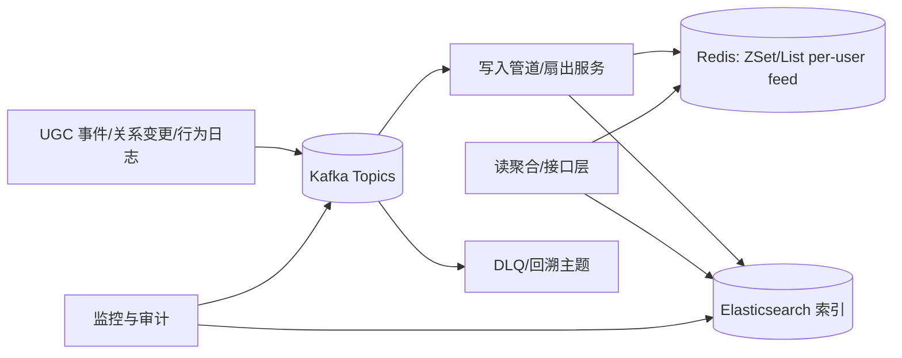

# 技术方案：Feed 流实现（Kafka/Redis/ES）

## 范围与目标
- 仅简单介绍 ActivityStreams 核心概念（Actor/Activity/Object/Verb/时间），不做字段映射表。
- 以阿里云实现作为“写扩散（推模式）”案例进行说明，不做具体产品/费用对比。
- 基于现有技术栈：Kafka（事件总线）、Redis（Feed 缓存/排序）、Elasticsearch（检索与聚合）。
- 覆盖三类核心场景：Timeline、Rank、推荐（用户行为）。

## 架构总览

### 读写路径
- 写路径（推/写扩散）：生产者投递到 Kafka，Ingestor 消费后进行扇出写入活跃粉丝的 Redis per-user feed；同时写入 ES 供拉取与检索。
- 读路径（拉/读扩散）：接口层优先从 Redis 读取（活跃用户/热点内容），未命中或长尾用户从 ES 查询并归并去重后返回。
- 回溯与修复：DLQ 存储异常事件，可按时间窗口重放修复 Redis 与 ES。

## 模式设计
### 推（写扩散）
- 适用：创作者高粉、热点内容、活跃粉丝群体；要求低读延迟、到达实时。
- 关键：
  - 扇出分片：按粉丝分片批写（pipeline/batch），限速与重试。
  - 去重/幂等：基于 `activityId` 作为幂等 key，ZSet score 使用 `publishAt`，tie-breaker 使用 `activityId`。
  - 修剪：每个用户 feed 仅保留最近 N 条（如 1k-5k），超出裁剪。
  - 热点隔离：热点活动额外写入公共热点 ZSet，供冷用户兜底。

### 拉（读扩散）
- 适用：长尾粉丝、低频登录用户；降低写放大与存储成本。
- 关键：
  - ES 索引：按 `creatorId`、`publishAt` 建索引，支持 terms+time range，排序使用 `publishAt desc, activityId desc`。
  - 关系快照：先查关注列表（缓存），构造 ES terms 查询；分页用游标（`search_after`）。
  - 合并：与 Redis 命中结果按时间归并去重，保障稳定顺序。

### 推拉结合
- 策略：按粉丝活跃度阈值分层（如近7天活跃/交互），活跃走推，长尾走拉；支持动态阈值与熔断降级。
- 兜底：Redis 未命中时合并热点 ZSet 与 ES 最近内容，保障首屏充足。

## 数据模型（简化，参考 ActivityStreams 概念）
- Activity：`activityId, actorId, verb, objectId, targetId?, publishAt, visibility`
- Feed Entry：`userId, activityId, score=publishAt(+tie), meta`
- Rank Score（可选）：`activityId, hotScore, updatedAt`

## 三类场景
### 1) Timeline（基于时间）
- 存储：Redis per-user ZSet（key: `feed:{userId}`，score: `publishAt`）。
- 写入：活跃粉丝推送；长尾用户读时从 ES 拉取并回填（可选小写回填）。
- 分页：基于游标（`lastScore,lastId`），避免重复与跳页。
- 更新：内容编辑/删除通过补偿事件更新/撤回 ZSet 与 ES。

### 2) Rank（基于热度）
- 公式：`hot = w1*like + w2*comment + w3*share + w4*uv - decay(age)`（例如指数衰减）。
- 计算：
  - 近实时：消费行为事件（Kafka）聚合增量分数，写入 Redis ZSet（`rank:global`/分域）。
  - 批处理：按小时/日重算并对齐，落 ES 便于审计与多维查询。
- 反作弊：速率限制、账号画像、特征加权、阈值冻结与人工审核通道。

### 3) 推荐（基于用户行为）
- 召回：基于关注、相似创作者、相似内容（词向量/标签），或协同过滤简版。
- 排序：混排策略（个性化得分 + 新鲜度 + 质量/安全因子），可配置权重。
- 在线：读请求获取候选（Redis/ES），按策略排序后返回，支持 A/B。

## 接口与分页
- GET `/feed/timeline?cursor=&limit=`：返回 entries 与新的 `cursor`。
- GET `/feed/rank?scope=&cursor=&limit=`：返回热榜。
- GET `/feed/reco?cursor=&limit=`：返回推荐混排。
- 游标：编码 `lastScore,lastId`，服务端校验与过期处理。

## 监控与 SLO
- Kafka 消费延迟、积压；Redis 命中率、慢查询；ES P50/P95；接口 P50/P95；错误率；成本。

## 一致性与容错
- 幂等写；去重；DLQ 与重放；按天分区回溯；灰度与降级（从推切换至拉）。

## 阿里云写扩散案例（简述）
- 以云上扇出写模式为例：写入放大可通过分片、批量、流水线、限速与热点隔离治理；与本方案一致的关键点是“活跃粉丝优先推送 + 热点兜底 + 拉取合并”。

## 演进路线
- 分层阈值动态化；近线聚合（如 Flink/Spark Streaming）；向量检索（ANN）用于相似内容召回；多活与跨地域同步。
