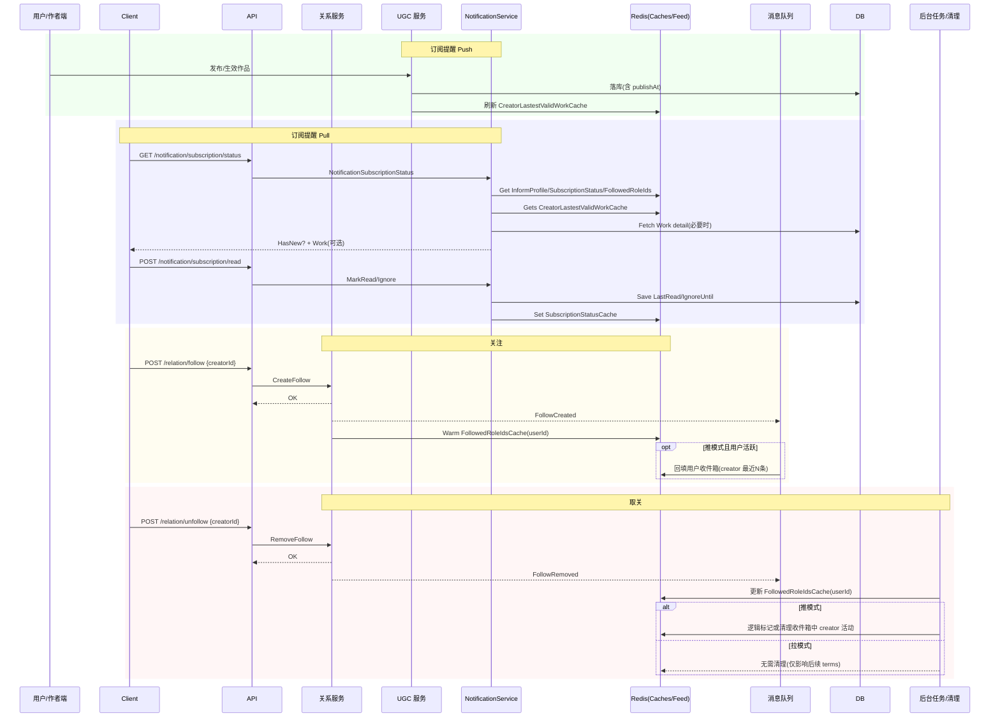

# 流程设计（综合图）：订阅提醒 / 关注 / 取关

```mermaid
sequenceDiagram
  participant U as 用户/作者端
  participant C as Client
  participant A as API
  participant RS as 关系服务
  participant UGC as UGC 服务
  participant S as NotificationService
  participant R as Redis(Caches/Feed)
  participant MQ as 消息队列
  participant D as DB
  participant BG as 后台任务/清理

  rect rgba(200,255,200,0.25)
  note over UGC,S: 订阅提醒 Push
  U->>UGC: 发布/生效作品
  UGC->>D: 落库(含 publishAt)
  UGC->>R: 刷新 CreatorLastestValidWorkCache
  end

  rect rgba(200,200,255,0.25)
  note over C,S: 订阅提醒 Pull
  C->>A: GET /notification/subscription/status
  A->>S: NotificationSubscriptionStatus
  S->>R: Get InformProfile/SubscriptionStatus/FollowedRoleIds
  S->>R: Gets CreatorLastestValidWorkCache
  S->>D: Fetch Work detail(必要时)
  S-->>C: HasNew? + Work(可选)
  C->>A: POST /notification/subscription/read
  A->>S: MarkRead/Ignore
  S->>D: Save LastRead/IgnoreUntil
  S->>R: Set SubscriptionStatusCache
  end

  rect rgba(255,245,200,0.25)
  note over RS,R: 关注
  C->>A: POST /relation/follow {creatorId}
  A->>RS: CreateFollow
  RS-->>A: OK
  RS-->>MQ: FollowCreated
  RS->>R: Warm FollowedRoleIdsCache(userId)
  opt 推模式且用户活跃
    MQ->>R: 回填用户收件箱(creator 最近N条)
  end
  end

  rect rgba(255,220,220,0.25)
  note over RS,BG: 取关
  C->>A: POST /relation/unfollow {creatorId}
  A->>RS: RemoveFollow
  RS-->>A: OK
  RS-->>MQ: FollowRemoved
  BG->>R: 更新 FollowedRoleIdsCache(userId)
  alt 推模式
    BG->>R: 逻辑标记或清理收件箱中 creator 活动
  else 拉模式
    BG-->>R: 无需清理(仅影响后续 terms)
  end
  end
```

